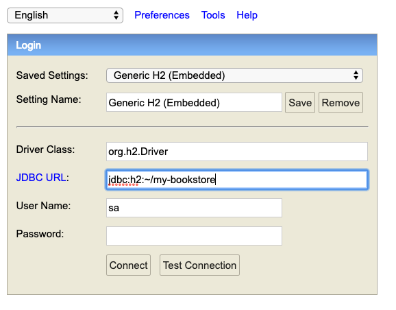
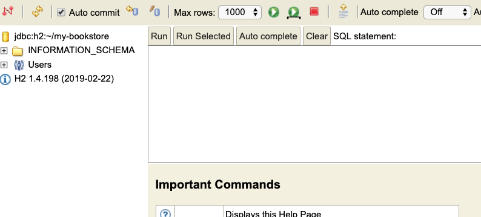
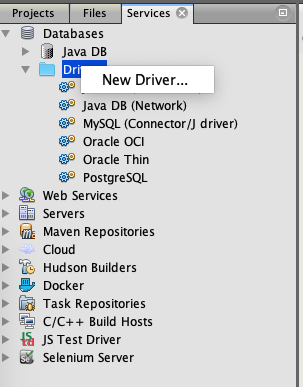
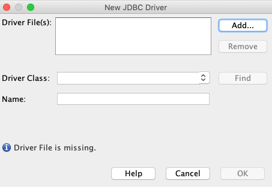
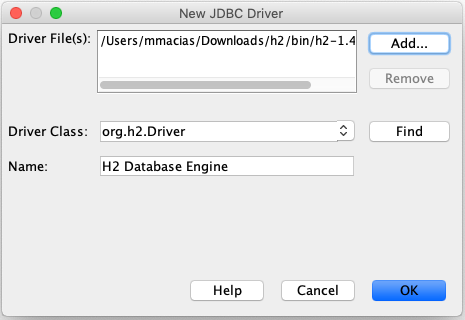

# Using plain Standard Query Language (SQL)

This tutorial is a quick walktrhough the SQL language. You could follow it with any database you
want (MySQL, PostgreSQL, Oracle...). But it would require you to install and configure services
in your computer.

To avoid having to install any SQL Database Software, this project
includes an embedded [H2 Database](http://www.h2database.com/): a relational database engine
written in Java with support for the SQL Standard. This way you can follow the tutorial without
polluting your laptop witn extra software and configurations.

To setup a basic H2 installation, you just have to run this project from Netbeans (or any other
IDE), or just run this command from the terminal:

```
./gradlew run
```

(or `gradlew.bat run` if you are using Windows)

After that, this will run the H2 engine in background. To submit SQL commands, you have two options:
using the embedded, browser-based console, or using an SQL client (GUI or command-line).

The following tutorial describes two alternatives to quickly start running SQL: using the H2
embedded, browser-based terminal (easiest) and configuring Netbeans as a database tool (some more
steps to setup, but much more confortable to work with).
 

## Table of contents of this tutorial

* [Connect to H2 using the browser-based console](#connect-to-h2-using-the-browser-based-console)
* [Connect to H2 database using Netbeans](#connect-to-h2-using-netbeans)
* [A walkthrough by basic SQL commands](#a-walkthrough-by-basic-sql-commands)

## Connect to H2 using the browser-based console

When you run the application with `./gradlew`, you can open the `http://localhost:8080` address
in your browser. The following form will appear:



Make sure the data is the same as in the avobe image.

In `JDBC URL`, you can modify the `~/my-bookstore` part by the folder where you want your
database to be stored.

After you click the `Connect...` button, the following screen will appear:



In the text box in the middle, you can write the SQL commands of this tutorial. To run them,
just push the green _play_ button.

## Connect to H2 using Netbeans

1. In the left pane of Netbeans, select the **Services** tab, and extend the "Databases"
   folder:
 
   

2. If you see an entry named "H2 Database Engine", jump to step 8. If not, continue by step 3.

3. Go to the H2 download page (http://www.h2database.com/html/download.html) and download
   and uncompress the platform independent zip of the latest version.

4. Right-click on the **Drivers** folder and select **New Driver...**

   

5. In the form, select **Add...** 

   

6. Navigate to the file named `h2-1-4-198.jar` of the uncompressed file that you downloaded in step
   3, and select it. 

   

7. The "New JDBC Driver" form now should look similar to this:

   
   
8. Right-click on `H2 Database Engine` and select **Connect Using...**

   
   
9. Make sure the "New Connection Wizard" form looks like this:

   
   
   (In `JDBC URL`, you can modify the `~/my-bookstore` part by the folder where you want your
    database to be stored) 

10. Now you can click "Finish"

11. In the databases view, a new entry appears. Right click and select "Execute command..." 

    

12. The following window appears. You can write the SQL commands of this tutorial in the text box.
    To execute them, just click the left icon "Run SQL", next to the Connection selector.

    


## A walkthrough by basic SQL commands 

We will do a very simple Books database with two tables which are related by a key. Feel free to
not literally follow this walkthrough and create your own database.

### 1. Create schema and use it

A **Schema** allows us to group all the components of our database (DB). It's a good idea to create
always our own schema and tell the DB we are using it by default

```SQL
CREATE SCHEMA Books;
USE Books;
```

### 2. Authors table

Before inserting data, we need to define the structure of our data with the [CREATE TABLE](https://www.w3schools.com/sql/sql_create_table.asp)
statement (please fist have a view to the linked documentation).

First, we will define an `Authors` table, with two columns:

* `Id`: a numeric identifier of the author that will be generated automatically every time we
  insert an author to the database.
* `Name`: a text of variable size (maximum 256 chars)  

SQL Command:
```sql
CREATE TABLE AUTHORS (
   Id INT NOT NULL PRIMARY KEY AUTO_INCREMENT,
   Name VARCHAR(256) NOT NULL
);
```

Please notice that each in the parentheses represents a column of the table. The first word of each
line is the name of the column, followed by the type of the data and extra constraints.

The following bullets describe the meaning of each column statements:

* Column `Id`:
    * `INT`: type of the author internal identifier (just an integer)
    * `NOT NULL`: constraint that disallows inserting empty values. There cannot be any author
      without an internal identifier.
    * `PRIMARY KEY`: this value will uniquely identify each row in the table
    * `AUTO_INCREMENT`: this value is automatically generated by the database, so we don't have to
      specify it when the data is inserted into the table.
* Column `Name`:
    * `VARCHAR(256)`: this column is a text of variable lenght, with 256 characters as maximum.
    * `NOT NULL`: disallows empty names. All the authors must have a name.

Now we cann insert some data into the `Authors` table with the [INSERT INTO](https://www.w3schools.com/sql/sql_insert.asp)
SQL statement (view linked documentation).

Please notice that we are just inserting the name of the author. The primary key is automatically
generated:

```sql
INSERT INTO Authors(Name) VALUES ('Miguel de Cervantes'), ('Milan Kundera'),
    ('William Shakespeare'), ('Pep Guardiola'), ('Manuel Vazquez Montalban');
```

Now we can query the database with the [SELECT](https://www.w3schools.com/sql/sql_select.asp)
statement. The following statement will show all the data in the table:

```sql
SELECT * FROM Authors;
```

(result:)
```
ID | NAME
1  | Miguel de Cervantes
2  | Milan Kundera
3  | William Shakespeare
4  | Pep Guardiola
5  | Manuel Vazquez Montalban
```

The SELECT also allows you providing extra information about how the data is presented. For example
it allows sorting it:

```sql
SELECT * FROM Authors ORDER BY Name;
```

(result:)
```
ID | NAME
5  | Manuel Vazquez Montalban
1  | Miguel de Cervantes
2  | Milan Kundera
4  | Pep Guardiola
3  | William Shakespeare
```

Please have a look to the [SELECT](https://www.w3schools.com/sql/sql_select.asp) statement documentation
to know more about the possibilities of this command.

### 3. Books table

The authors table is very simple, not because it has only two columns but because they do not have
special constraints or relations with other tables.

The following `Books` table is more complex:

```sql
CREATE TABLE Books (
   Id INT NOT NULL PRIMARY KEY AUTO_INCREMENT,
   ISBN varchar(32) UNIQUE NOT NULL,
   Title varchar(256) NOT NULL,
   Year int,
   AuthorId INT NOT NULL,
   FOREIGN KEY (AuthorId) REFERENCES Authors(Id)
);
```

The explanation of each column constraints are (omitting aspects we already explained):

* `Id` is equivalent to the `Authors.Id` column. It's an auto-generated identifier used as primary
  key.
* `ISBN` has a `UNIQUE` constraint. That means that there can't be two book entries with the same
  ISBN code.
  - That means that `ISBN` could be the primary key of the table, but it's a good practice to use
    auto-generated numeric `Id` fields, in case we want to setup relations from other tables, because
    integers are much faster than text strings.
* `Year` is _nullable_. That means we could add books whose year is unknown.
* `AuthorID` is a non-null integer that stores the ID (as in the `Authors` table `Id`) of the Author
   of the book.
   - In order to enforce the **referential integrity** the next line tells SQL that `AuthorID` is
     a _foreign key_ that references to the `ID` column of the `Authors` table.
     
     `FOREIGN KEY (AuthorID) REFERENCES Authors(Id)`
     
Now we could insert data in a similar way to the `Authors` table:

```sql
INSERT INTO Books(ISBN, Title, Year, AuthorID)
    VALUES ('012-3-45-678910-1', 'Tattoo', 1975, 5);
```

The above command will insert a book from _Manuel Vazquez Montalban_ (`Id = 5` according to the
previous `SELECT` query).

Let's try to **break the referential integrity** by trying to add a non-existing author ID:

```sql
INSERT INTO Books(ISBN, TITLE, YEAR, AUTHORID)
    VALUES('111-11-1-111111-1', 'Momo', 1973, 7);
```

You will see an error similar to:
```
Referential integrity constraint violation: "CONSTRAINT_3C7:
BOOKS.BOOKS FOREIGN KEY(AUTHORID) REFERENCES BOOKS.AUTHORS(ID) (7)"
```

The following commands will also return error:

```sql
INSERT INTO Books(ISBN, TITLE, YEAR, AUTHORID)
VALUES('012-3-45-678910-1', 'Don Quijote de la Mancha', 1605, 1)
```
👆 will break the `UNIQUE KEY` constraint because inserts a repeated ISBN.

```sql
INSERT INTO Books(ISBN, YEAR, AUTHORID)
VALUES('111-11-1-111111-1', 2009, 2)
```

👆 will break the `NON NULL` constraint because tries to insert a book without title.

The above way to specify an author for a book is not confortable, since the `Id` is meaningful for
the database but not for us (we should first query the authors table, annotate the ID, and then
write it).

To save steps, we can create an *embedded* `SELECT` Query to get the number of the author we want:

```sql
INSERT into books(isbn, title, year, AuthorID)
VALUES ('111-1-11-111111-1', 'Hamlet', 1603,
           (SELECT Id FROM AUTHORS WHERE Name = 'William Shakespeare')
       );
```

We can repeat the same formula to insert more books:

```sql
INSERT into books(isbn, title, year, AuthorID)
VALUES ('222-2-22-222222-2', 'Laughable Loves', 1969,
            (SELECT Id FROM AUTHORS WHERE Name = 'Milan Kundera')),
       ('333-3-33-333333-3', 'Rinconete and Cortadillo', 1613,
            (SELECT Id FROM AUTHORS WHERE Name = 'Miguel de Cervantes')),
       ('444-4-44-444444-4', 'The unbearable lightness of being', 1984,
            (SELECT Id FROM AUTHORS WHERE Name = 'Milan Kundera'));
```

(For those who want yo extend their knowledge, you can also use
[JOINS](https://www.w3schools.com/sql/sql_join.asp) as an alternative to the embedded `SELECT`)

Here you have extra examples of the `SELECT` statement:

* Select all the books, ordered by more recent to older:

```sql
SELECT * FROM Books ORDER BY YEAR DESC;
```

(result:)

```
ID | ISBN              | TITLE                             | YEAR | AUTHORID
8  | 444-4-44-444444-4 | The unbearable lightness of being | 1984 | 2
1  | 012-3-45-678910-1 | Tattoo                            | 1975 | 5
6  | 222-2-22-222222-2 | Laughable Loves                   | 1969 | 2
7  | 333-3-33-333333-3 | Rinconete and Cortadillo          | 1613 | 1
4  | 111-1-11-111111-1 | Hamlet                            | 1603 | 3
```

* Select all the books, ordered by more recent to older, but limiting the returned results to 2:

```sql
SELECT * FROM Books ORDER BY YEAR DESC LIMIT(2);
```
(result:)
```
ID | ISBN              | TITLE                             | YEAR | AUTHORID
8  | 444-4-44-444444-4 | The unbearable lightness of being | 1984 | 2
1  | 012-3-45-678910-1 | Tattoo                            | 1975 | 5
```

* Select all the books whose year is greater than 1900 (`WHERE` clause)

```sql
SELECT * FROM Books WHERE Year > 1900 ORDER BY YEAR DESC;
```

(result:)

```
ID | ISBN              | TITLE                             | YEAR | AUTHORID
8  | 444-4-44-444444-4 | The unbearable lightness of being | 1984 | 2
1  | 012-3-45-678910-1 | Tattoo                            | 1975 | 5
6  | 222-2-22-222222-2 | Laughable Loves                   | 1969 | 2
```

* Selecting the columns you want to see in the results:

```sql
SELECT Title, Year FROM Books WHERE Year > 1900 ORDER BY YEAR DESC;
```

(result:)

```
TITLE                             | YEAR
The unbearable lightness of being | 1984
Tattoo                            | 1975
Laughable Loves                   | 1969
```

* Aggregate data 

```sql
SELECT COUNT(*) AS ModernBooks,
       MIN(year) AS OldestYear,
       MAX(year) AS MostRecentYear
FROM Books Where year > 1900;
```

(result:)

```
MODERNBOOKS | OLDESTYEAR | MOSTRECENTYEAR
3           | 1969       | 1984
```

### 4. Querying data from multiple tables

In the above queries of the `Books` table, the Author was returned as a numeric ID, which is not
meaningful at all for a user.

SQL Allows querying and joining data from different Tables: 

```sql
SELECT Books.Title, Books.Year, Authors.Name
    FROM Books, Authors
    WHERE Books.AuthorID = Authors.ID;
```

(result:)

```
TITLE                             | YEAR | NAME
Tattoo                            | 1975 | Manuel Vazquez Montalban
Hamlet                            | 1603 | William Shakespeare
Laughable Loves                   | 1969 | Milan Kundera
Rinconete and Cortadillo          | 1613 | Miguel de Cervantes
The unbearable lightness of being | 1984 | Milan Kundera
```

You can also include `WHERE` clauses FROM both tables. For example, to show all the books from the
20th Century from authors whose name start in `M`:

```sql
SELECT Books.Title, Books.Year, Authors.Name
    FROM Books, Authors
    WHERE Year > 1900 AND Year <= 2000
          AND Name LIKE 'M%'
          AND Books.AuthorID = Authors.ID
    ORDER BY Year ASC;
```

Please note the use of the `LIKE` operator for text, plus the wildcard `%`.

(result:)

```
TITLE                             | YEAR | NAME
Laughable Loves                   | 1969 | Milan Kundera
Tattoo                            | 1975 | Manuel Vazquez Montalban
The unbearable lightness of being | 1984 | Milan Kundera
```

### 5. Deleting data

You can delete data with the [DELETE](https://www.w3schools.com/sql/sql_delete.asp) statement:

```sql
DELETE FROM Books where isbn = '333-3-33-333333-3'
```

⚠️⚠️⚠️⚠️ [Don't forget to put the `WHERE` in the `DELETE FROM`!!!!](https://www.youtube.com/watch?v=i_cVJgIz_Cs) ⚠️⚠️⚠️⚠️

This deletion is invalid because it would break the referential integrity:

```sql
DELETE FROM Authors WHERE Name = 'Milan Kundera';
```

Why? Because there are books that are still referencing to this author. They would be referencing
to an unexisting author.

To deal this situation, we have several alternatives:

1. Do nothing. It's OK for our application to not allow removing data while other rows refer to it.
2. First delete all the books from this author, then safely delete the author:
   ```sql
   DELETE FROM Books WHERE AuthorID = (SELECT id FROM Authors WHERE Name = 'Milan Kundera');
   DELETE FROM Authors WHERE Name = 'Milan Kundera';
   ```
3. When you create the table `Books`, adding the following clause to the `FOREIGN KEY` definition:

   `FOREIGN KEY (AuthorID) REFERENCES Authors(ID) ON DELETE CASCADE`
   
   This means that, when an author is removed, all its books will be removed too.

(there is a 4th option, which uses the [ALTER TABLE](https://www.w3schools.com/sql/sql_alter.asp)
statement to modify the structure of an existing table, but may be pretty complex for modifying
constraints)

